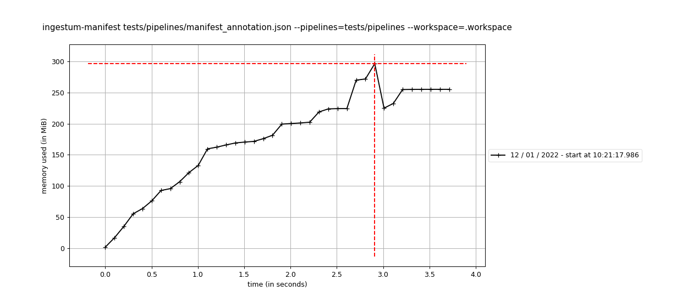

Instrumentation
===============

Measure memory
--------------

Use the options :code:`--instrumentation measure-memory` to output the measure 
of the max memory consumed by the manifest using `memory_profile <https://github.com/pythonprofilers/memory_profiler>`_ `psutil_pss`.

Supported commands:

* :code:`ingestum-manifest`

.. code-block:: bash

    $ ingestum-manifest tests/pipelines/manifest_annotation.json --pipelines=tests/pipelines --workspace=.workspace --instrumentation measure-memory
    ...
    {"written_at": "2022-01-11T14:23:31.943Z", "written_ts": 1641911011943999000, "msg": "memory_usage_max=321.0859375", "type": "log", "logger": "ingestum.api.cli:manifests", "thread": "MainThread", "level": "INFO", "module": "ingestum-manifest", "line_no": 89}
    ...

Profile time-based memory usage
-------------------------------

Sometimes it is useful to have full memory usage reports as a function of time 
(not line-by-line) of external processes (be it Python scripts or not). 
In this case the executable `mprof <https://github.com/pythonprofilers/memory_profiler#time-based-memory-usage>`_ 
might be useful. Use it like:

.. code-block:: bash

    $ pip install -e . # if you haven't done it yet
    $ mprof run tools/ingestum-manifest tests/pipelines/manifest_annotation.json --pipelines=tests/pipelines --workspace=.workspace 
    mprof: Sampling memory every 0.1s
    running new process
    $ pip install matplotlib # required for plot
    $ mprof plot

